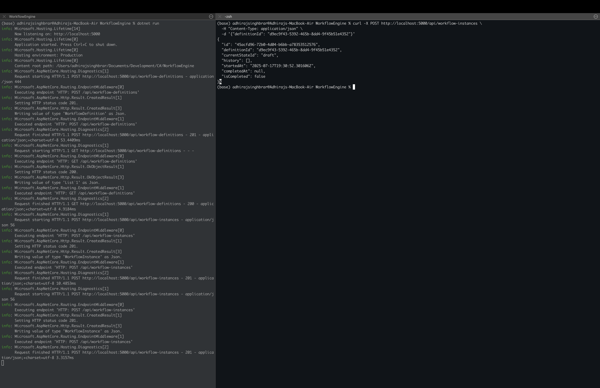

# Workflow Engine
Simple workflow engine for managing state transitions

## Demo


## What it does
This project let you create workflows with states and actions. you can start workflow instances and execute actions to move through different states.

## How to run
1. clone this repository
2. run `dotnet run` in terminal
3. api will be available at `http://localhost:5000`

## Api endpoints
### Workflow definitions
- `POST /api/workflow-definitions` - create new workflow
- `GET /api/workflow-definitions` - get all workflows
- `GET /api/workflow-definitions/{id}` - get specific workflow

### Workflow instances
- `POST /api/workflow-instances` - start new workflow instance
- `GET /api/workflow-instances` - get all instances
- `GET /api/workflow-instances/{id}` - get specific instance
- `POST /api/workflow-instances/{id}/execute` - execute action

## Example workflow
```json
{
  "name": "document approval",
  "states": [
    {"id": "draft", "name": "Draft", "isInitial": true},
    {"id": "review", "name": "Under Review"},
    {"id": "approved", "name": "Approved", "isFinal": true}
  ],
  "actions": [
    {"id": "submit", "name": "Submit for Review", "fromStates": ["draft"], "toState": "review"},
    {"id": "approve", "name": "Approve", "fromStates": ["review"], "toState": "approved"}
  ]
}
```

## Data storage
Workflow definitions and instances are saved to json files in `data/` folder.

## Testing the api
You can test endpoints using curl or postman:

### Create workflow definition
```bash
curl -X POST http://localhost:5000/api/workflow-definitions \
  -H "Content-Type: application/json" \
  -d '{
    "name": "document approval",
    "states": [
      {"id": "draft", "name": "Draft", "isInitial": true},
      {"id": "review", "name": "Under Review"},
      {"id": "approved", "name": "Approved", "isFinal": true}
    ],
    "actions": [
      {"id": "submit", "name": "Submit for Review", "fromStates": ["draft"], "toState": "review"},
      {"id": "approve", "name": "Approve", "fromStates": ["review"], "toState": "approved"}
    ]
  }'
```

### Start workflow instance
```bash
curl -X POST http://localhost:5000/api/workflow-instances \
  -H "Content-Type: application/json" \
  -d '{"definitionId": "your-workflow-id-here"}'
```

### Execute action
```bash
curl -X POST http://localhost:5000/api/workflow-instances/your-instance-id/execute \
  -H "Content-Type: application/json" \
  -d '{"actionId": "submit"}'
```

### Get all workflows
```bash
curl http://localhost:5000/api/workflow-definitions
```

### Get workflow instance
```bash
curl http://localhost:5000/api/workflow-instances/your-instance-id
```

## Requirements
- .NET 6 or higher